# Compress Video to Target Size

**Compress Video to Target Size** is an iPhone app that helps you shrink videos to a specific file size so they are easier to share, upload, and store.

If you have ever seen messages like *"file too large"* when sending a video, this app is made for that exact problem.

## Showcase

Click any preview to open the high-quality screenshot.

<table>
  <tr>
    <td align="center">
      <a href="showcase/high/main-page.png">
        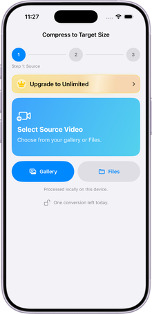
      </a>
       
      Main Page (Light)
    </td>
    <td align="center">
      <a href="showcase/high/ready-to-convert.png">
        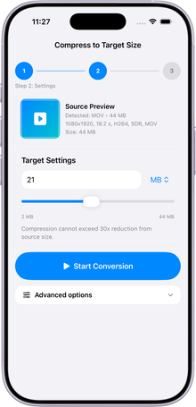
      </a>
       
      Ready To Convert (Light)
    </td>
    <td align="center">
      <a href="showcase/high/done-window.png">
        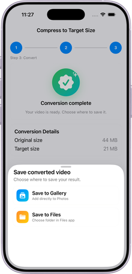
      </a>
       
      Done Window (Light)
    </td>
  </tr>
  <tr>
    <td align="center">
      <a href="showcase/high/paywall-window.png">
        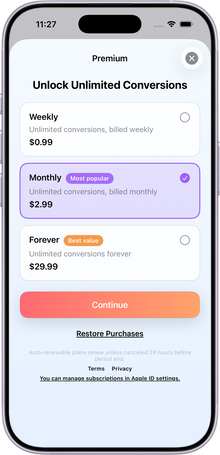
      </a>
       
      Paywall Window (Light)
    </td>
    <td align="center">
      <a href="showcase/high/advanced-options-bottom.png">
        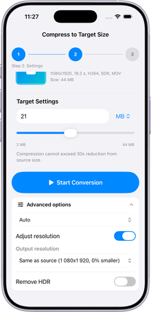
      </a>
       
      Advanced Options (Bottom, Light)
    </td>
    <td align="center">
      <a href="showcase/high/format-dropdown-open.png">
        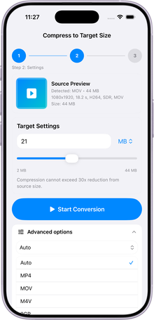
      </a>
       
      Format Dropdown Opened (Light)
    </td>
  </tr>
  <tr>
    <td align="center">
      <a href="showcase/high/resolution-dropdown-open.png">
        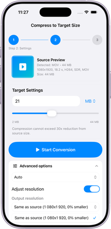
      </a>
       
      Resolution Dropdown Opened (Light)
    </td>
    <td align="center">
      <a href="showcase/high/main-page-dark.png">
        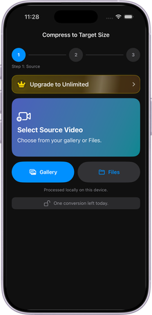
      </a>
       
      Main Page (Dark)
    </td>
    <td align="center">
      <a href="showcase/high/ready-to-convert-dark.png">
        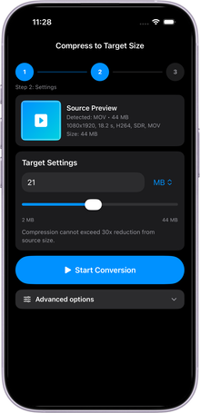
      </a>
       
      Ready To Convert (Dark)
    </td>
  </tr>
  <tr>
    <td align="center">
      <a href="showcase/high/done-window-dark.png">
        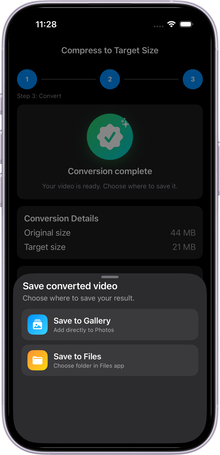
      </a>
       
      Done Window (Dark)
    </td>
    <td align="center">
      <a href="showcase/high/paywall-window-dark.png">
        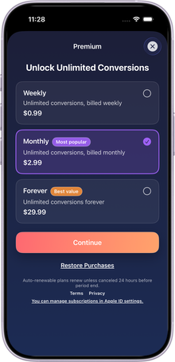
      </a>
       
      Paywall Window (Dark)
    </td>
    <td align="center">
      <a href="showcase/high/advanced-options-bottom-dark.png">
        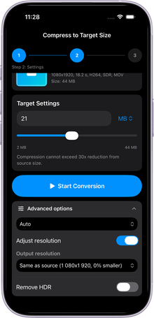
      </a>
       
      Advanced Options (Bottom, Dark)
    </td>
  </tr>
  <tr>
    <td align="center">
      <a href="showcase/high/format-dropdown-open-dark.png">
        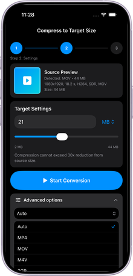
      </a>
       
      Format Dropdown Opened (Dark)
    </td>
    <td align="center">
      <a href="showcase/high/resolution-dropdown-open-dark.png">
        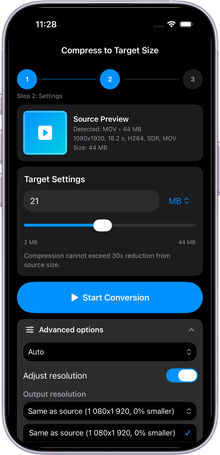
      </a>
       
      Resolution Dropdown Opened (Dark)
    </td>
    <td></td>
  </tr>
</table>

## Why this app exists

Many video tools only offer "small", "medium", or "large" quality presets. That often means your final file is still too big, or much smaller than needed.

This app is built to aim for a target size you choose, while keeping the best possible visual quality under that limit.

## What you can do

- Pick a video from your gallery
- Set your target size with your own number
- Choose size units (`KB`, `MB`, `GB`)
- Keep source format automatically or choose a different output format
- Turn on optional resize (up to 10x) when needed
- Remove HDR if you want better compatibility or smaller output
- Save the final video back to your gallery

## Who is this for

This app is useful for:

- Social media creators who need upload-ready file sizes
- Students uploading videos to school portals with strict limits
- Job seekers sending portfolio or interview videos by email
- Teams sharing clips in chats with attachment size restrictions
- Anyone trying to free phone storage without losing unnecessary quality

## Common use cases

- **Email attachments:** make a video fit under common email limits
- **Messaging apps:** reduce size before sending in chat
- **Cloud upload limits:** hit exact file-size requirements
- **Faster sharing:** smaller files upload and send faster
- **Storage cleanup:** keep memories while saving space

## What makes it different

- Size-first workflow: you choose the final size target
- Quality-aware output: tries to stay as close as possible without going over
- Retry protection: if first result is still too large, it automatically tries again
- Practical controls for real sharing situations

## Simple workflow

1. Select a video
2. Enter your target size
3. Start conversion
4. Save and share

## App goal

The main goal is simple: **create a video that is not bigger than your target size, while preserving as much quality as possible.**

## Keywords

video compressor iPhone, reduce video file size, compress video for email, video size reducer, target file size video app, compress video for upload, shrink video without losing too much quality, make video smaller for sharing.
